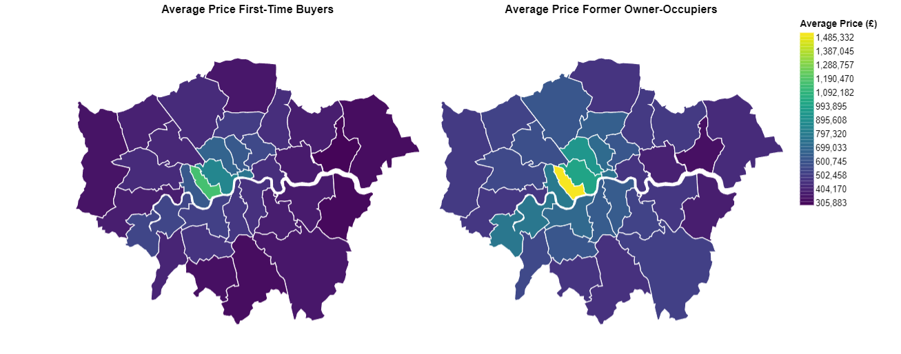
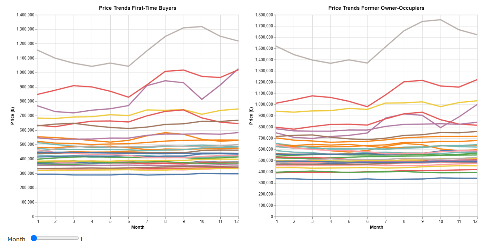
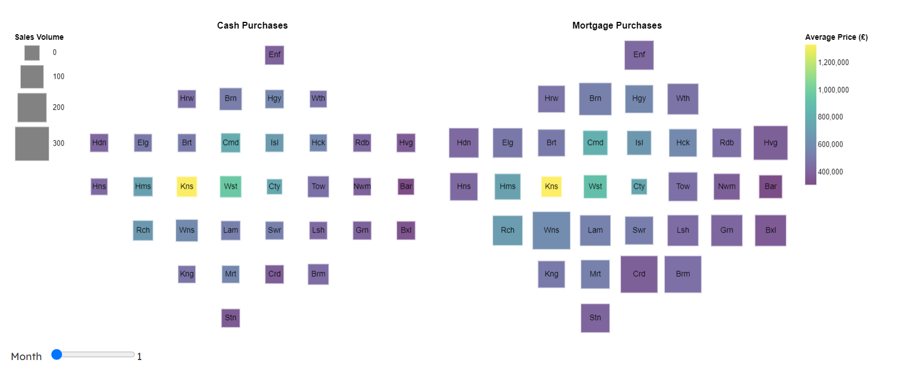
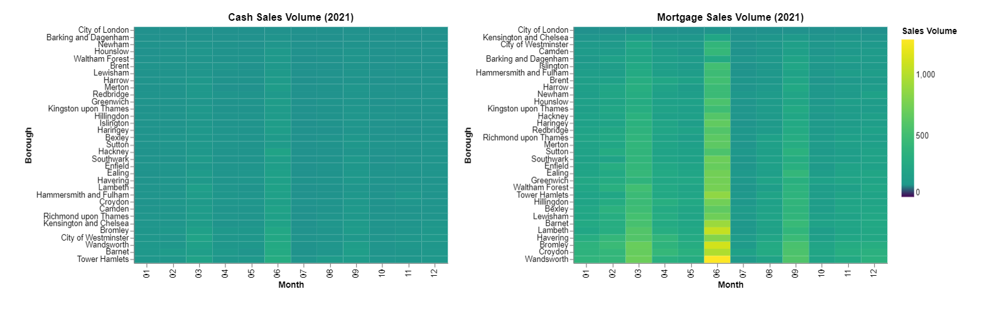

# London Housing Affordability Visualization

This project explores spatial and temporal variations in housing affordability across London using interactive, data-driven visualizations. It compares average house prices by buyer type (first-time vs. former owner-occupier) and purchase method (cash vs. mortgage) across boroughs, revealing trends in economic accessibility and neighbourhood transformation.

## Overview

This project aims to address the following key questions:
- How do spatial and temporal variations in housing affordability reveal patterns of economic accessibility?
- What differences can be seen between first-time buyers and former owner-occupiers?
- How do patterns of cash and mortgage purchases indicate neighbourhood transformation?

All visualizations are interactive and created using the Elm + VegaLite stack with publicly available datasets.

## Visualizations

### 1. **Borough Price Maps**
- Choropleth maps of average prices by borough for both first-time buyers and former owner-occupiers
- Month-by-month filter via interactive slider
- Region selector to highlight borough-specific data

### 2. **Price Trend Line Charts**
- Monthly price trend lines for all boroughs
- Highlighting of selected boroughs to analyze specific fluctuations
- Comparison of buyer types over time

### 3. **Stacked Area Charts**
- Proportional distribution of total housing prices by borough
- Compares market share between boroughs for each buyer type
- Tracks shifts across 2021

### 4. **Cash vs. Mortgage Purchase Maps**
- Grid-style maps with spatial layout of boroughs
- Average price and sales volume encoded through color and size
- Split view to compare cash and mortgage trends

### 5. **Sales Volume Heatmaps**
- Borough-wise monthly heatmaps of sales volume
- Reveals temporal peaks in buyer activity (e.g. around Stamp Duty Holiday)

## Insights

- A strong west-east divide exists in affordability, with boroughs like Kensington and Westminster remaining unaffordable for first-time buyers, while Barking and Dagenham remains consistently accessible.
- Former owner-occupiers consistently purchase at higher price points and face greater price volatility, especially in high-end boroughs.
- The Stamp Duty Holiday caused significant spikes in prices and transactions, particularly in wealthier boroughs.
- Outer boroughs are dominated by mortgage buyers, indicating greater affordability and accessibility for financed buyers.
- Central boroughs are dominated by cash purchases, reflecting wealth concentration and investment-driven markets.


## Technologies Used

- [Elm](https://elm-lang.org/)
- [Elm-VegaLite](https://github.com/gicentre/elm-vegalite)
- [VegaLite](https://vega.github.io/vega-lite/)
- [Topological GeoJSON](https://gicentre.github.io/data/geoTutorials/londonBoroughs.json)
- CSV Data from London Housing Sales and Land Registry

## Getting Started

Clone the repo and run your Elm environment with the VegaLite and Tidy libraries. All data is fetched from public URLs and no authentication is required.

```bash
git clone https://github.com/yourusername/london-housing-affordability-visualization.git
cd london-housing-affordability-visualization
elm reactor
```






